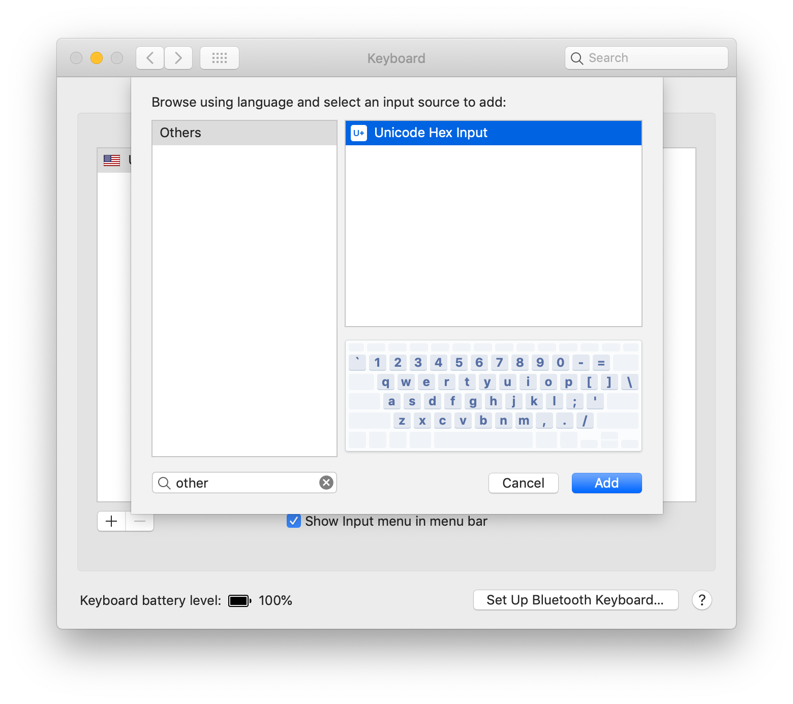
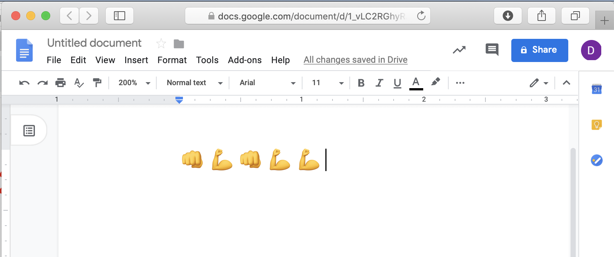

# Exercise 9: Gesture Controlled USB Emoji Keyboard

Printing emojis is cool, but it would be even better if we could make a gesture controlled keyboard. This exercise only works on Linux and MacOS so, if you're running Windows, try teaming up with a MacOS or Linux person for this part.

Open __ArduinoSketchs/Emoji_Test/Emoji_Test.ino__, in the Arduino IDE. Note that this code breaks some Arduino conventions by using `#define`.

## Linux

In the code, uncomment the `#define` for LINUX.

    #define LINUX

## MacOS

In the code, uncomment the `#define` for MACOS.

    #define MACOS

For MacOS, you also need to enable support for emoji keyboards. Open System Preferences. Choose Keyboard. Select the Input Sources tab. Press the plus button. Search for 'other'. Choose 'Unicode Hex Input'. Press that add button.

## Running the Test

Compile and upload the code onto your Arduino using __Sketch -> Upload__. Open a new [Google Doc](https://doc.new) or another editor that supports emojis. Use your mouse to set focus into the editor. Shake the Arduino to activate the accelerometer and a bicep emoji 💪should appear. 

## Building a Keyboard

Now you are ready to build a keyboard. Create a new sketch in the Arduino IDE. Combine the code from  `IMU_Classifier` and the `Emoji_Test` to create an emoji keyboard. Where a gesture is recognized print out the corresponding emoji using the USB Keyboard.

### Note

__NOTE:__ once you load code that runs the USB Keyboard, the Arduino IDE might not be able to see the serial port when you want to load new code. Double click the reset button on the Nano 33 BLE Sense before you run __Sketch -> Upload__.

Next [Exercise 10: Next Steps](exercise10.md)